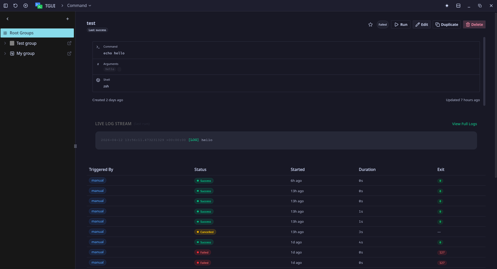
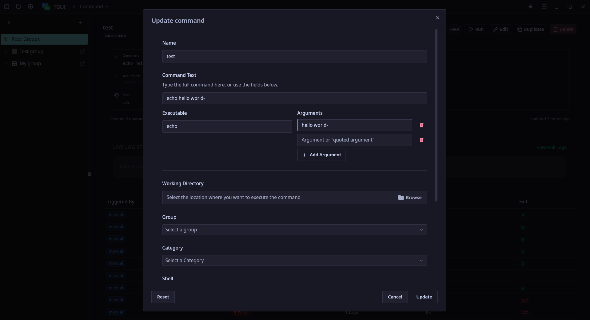
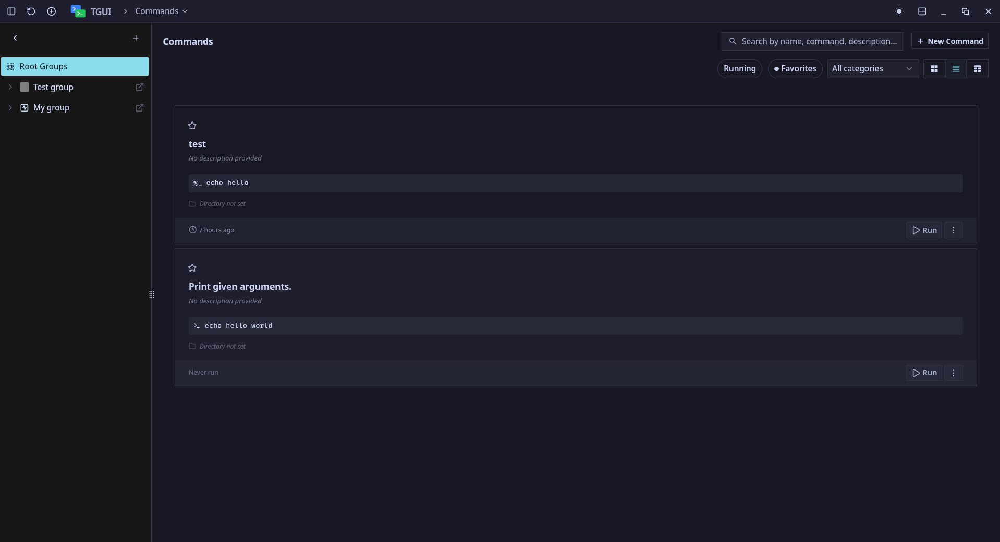
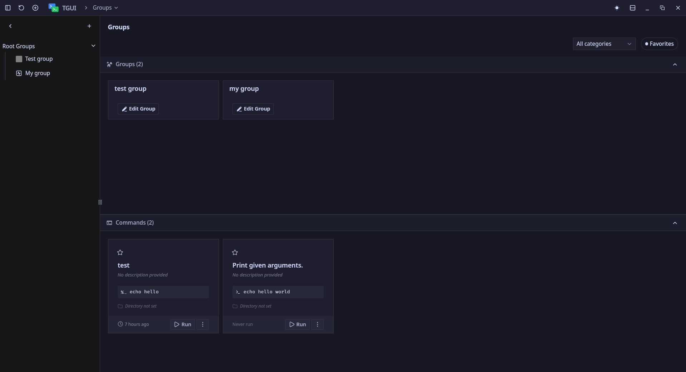

# TGUI — Terminal commands in one click

> A unix desktop app for saving, organizing, and executing terminal commands — with real-time log streaming and process management.

_work for windows app is in progress_



---

## Why

- Terminal aliases are per-machine.
- Shell history forgets context.
- Launcher apps don't show logs.

TGUI stores commands with their full execution context (working directory, arguments, environment variables, shell) and lets you run them from a searchable UI — logs streaming live, processes surviving window closure.

---

## Status

**Active development — pre-release.**
Core execution engine and command management are functional. Currently testing usability with early users and evaluating a shift from raw process spawning to PTY for interactive command support (in turn adding windows support). Planning release after that milestone.

See [progress breakdown](#progress) below.

---

## Features (implemented)

- **Command library** — save commands with name, args, working directory, env vars, shell
- **Group hierarchy** — nest commands in groups; circular reference prevention on moves
- **Settings inheritance** — working dir / env vars / shell resolve command → group → system default
- **One-click execution** — spawn process, stream stdout/stderr in real time (10k line circular buffer)
- **Process control** — graceful SIGTERM or force SIGKILL; process tree kill for child processes
- **Execution history** — per-command run history with status, exit code, timestamps, stats
- **Workflow API** — chain commands as ordered steps with delay and wait-for-completion options
- **Categories & favorites** — organize and filter; favorites pinned at top
- **Search** — case-insensitive substring match across name, command, description
- **Theme** — light / dark / system

---

## Not yet implemented

- System tray + background process persistence (window close → process keeps running)
- Templates (variable-substitution blueprints for project setup)
- Drag-and-drop command reordering
- Multi-window log viewer
- In-log search (Ctrl+F)
- Scheduled commands
- Export / import
- PTY support (interactive commands) — **in evaluation**

---

## Progress

| Phase | What                                                                 | Status        |
| ----- | -------------------------------------------------------------------- | ------------- |
| 1     | Project setup, SQLite schema, CRUD, basic UI shell                   | ✅ Done       |
| 1     | Process spawn/kill, log streaming, frontend integration              | ✅ Done       |
| 2     | Group hierarchy, settings inheritance, categories, favorites, search | ✅ Done       |
| 2     | Env vars, execution history, process tree kill                       | ✅ Done       |
| 2     | Workflow + workflow step management (API layer)                      | ✅ Done       |
| 2     | Drag-and-drop reordering                                             | 🔲 Pending    |
| 3     | System tray + background persistence                                 | 🔲 Pending    |
| 3     | Template engine                                                      | 🔲 Pending    |
| 4     | Cross-platform testing, packaging (AppImage, .deb, .msi)             | 🔲 Pending    |
| —     | PTY / interactive process support                                    | 🔬 Evaluating |

---

## Tech stack

| Layer           | Tech                                    |
| --------------- | --------------------------------------- |
| Shell / runtime | Tauri (Rust backend + WebView frontend) |
| Backend         | Rust, rusqlite, tokio                   |
| Frontend        | Vue 3, TypeScript, Pinia                |
| Storage         | SQLite (WAL mode)                       |
| IPC             | Tauri commands + events                 |

---

## Build from source

**Prerequisites**: Rust (stable), Node.js 20+, npm, [Tauri prerequisites](https://tauri.app/v1/guides/getting-started/prerequisites) for your OS.

```bash
git clone https://github.com/snh1999/tgui
cd tgui
npm install
npm run tauri dev
```

**Production build:**

```bash
npm tauri build
```

Output in `src-tauri/target/release/bundle/`.

---

## Architecture notes

TGUI uses Tauri's IPC model: the Vue frontend invokes typed Rust commands and listens to events. The backend owns all process state in a thread-safe `HashMap` (execution ID → process handle + log buffer). Log lines emit as batched events every 50ms to avoid IPC saturation. The DB layer uses a single `Arc<Mutex<Connection>>` with WAL mode for safe concurrent reads.

The API surface covers ~40 commands across command management, group hierarchy, categories, settings, workflow orchestration, execution history, and process control. Settings inheritance walks the group ancestor chain at spawn time so commands always run with the right context without redundant storage.







---

## License

GPL-3.0
